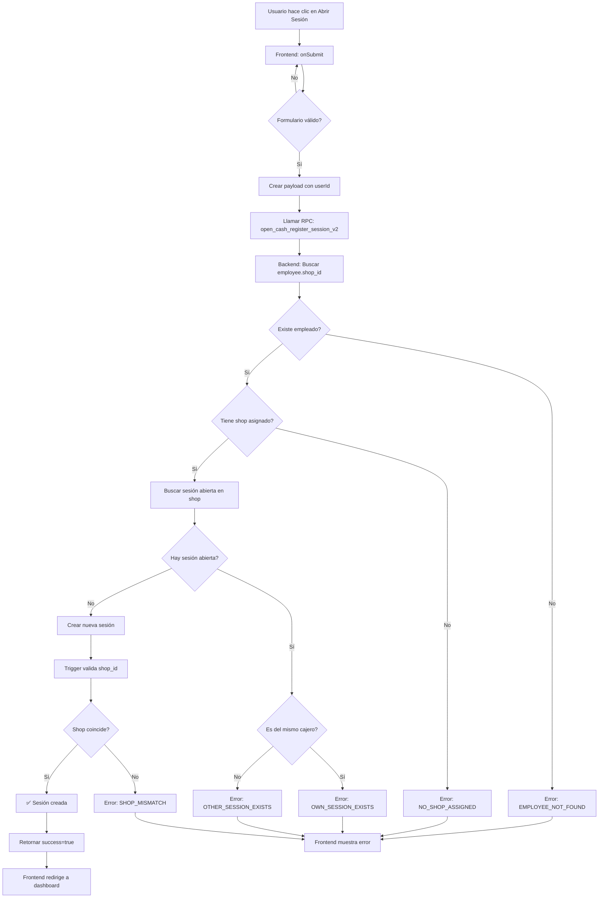

# Resumen de Correcciones - Sistema de Validación de Sesiones

## 🎯 Problemas Identificados y Solucionados

### Problema 1: Error al cambiar de shop

**Descripción:** Si un usuario cambia de shop al iniciar sesión, el sistema permite abrir caja incorrectamente y el acceso denegado da error.

**Causa Raíz:**

- El código consultaba `hr.employees` con `user_id` que NO existe en la tabla
- La tabla `hr.employees` tiene `id` que ES IGUAL a `user.id` (confirmado en edge function)
- Validación usando metadatos desactualizados de `shopId`

**Solución Implementada:**

1. ✅ Eliminada consulta innecesaria a `hr.employees`
2. ✅ Uso directo de `user_id === employee_id` (confirmado por edge function)
3. ✅ Creado trigger SQL para validar shop del cajero en INSERT
4. ✅ Nueva función RPC `open_cash_register_session_v2` que:
   - Recibe solo `user_id`
   - Obtiene automáticamente el shop de `hr.employees`
   - Valida que no haya otra sesión abierta
   - Previene apertura en shop incorrecto

### Problema 2: Mezcla con consultas a otras tablas

**Descripción:** El código consultaba `hr.employees` innecesariamente usando `user_id` que no existe en la columna.

**Solución:**

- ✅ Eliminado método `getEmployeeIdByUser()` de AuthService
- ✅ Simplificado `checkDashboardAccess()` para usar directamente `userId === employeeId`
- ✅ Eliminadas todas las consultas SQL del frontend
- ✅ Validación movida a nivel de base de datos (trigger + RPC function)

### Problema 3: Error PGRST116

**Descripción:** Error "Cannot coerce the result to a single JSON object" al buscar sesiones.

**Solución:**

- ✅ Cambiado `.single()` por `.maybeSingle()` en `getOpenSessionByShop()`
- ✅ Manejo correcto del caso cuando no hay sesión (retorna `null` sin error)

## 📦 Archivos Modificados

### 1. Base de Datos

**Archivo:** `media/db/09_CASH_REGISTER_SHOP_VALIDATION.sql` (NUEVO)

**Componentes creados:**

```sql
-- 1. Función de trigger para validar shop
sales.validate_cashier_shop_on_session()

-- 2. Trigger BEFORE INSERT
trg_validate_cashier_shop_before_insert

-- 3. Nueva función RPC mejorada
sales.open_cash_register_session_v2(
  p_user_id UUID,
  p_opening_balance NUMERIC,
  p_session_type TEXT,
  p_opening_notes TEXT
)

-- 4. Vista de debugging
sales.v_active_sessions_with_employee_info
```

**Validaciones implementadas:**

- ✅ Verifica que `employee.shop_id === session.shop_id`
- ✅ Rechaza INSERT si no coinciden los shops
- ✅ Valida automáticamente que no haya sesión abierta
- ✅ Mensajes de error descriptivos con códigos

### 2. Frontend - Services

#### AuthService (`auth-service.ts`)

**Cambios:**

- ❌ Eliminado: `getEmployeeIdByUser()` (ya no se necesita)
- ✅ Simplificado: Usa solo metadatos del usuario

#### CashRegisterService (`cash-register-service.ts`)

**Cambios:**

```typescript
// ANTES
async openSession(payload: OpenSessionPayload) {
  // Requería: shopId, cashierId, openingBalance, etc.
  rpc('open_cash_register_session', {
    p_shop_id: payload.shopId,
    p_cashier_id: payload.cashierId,
    ...
  })
}

async checkDashboardAccess(userId, shopId) {
  // Consultaba hr.employees con user_id (NO EXISTE)
  .from('employees')
  .select('id, shop_id')
  .eq('user_id', userId) // ❌ COLUMNA NO EXISTE
}

async getOpenSessionByShop(shopId) {
  .single() // ❌ Causa error PGRST116
}

// DESPUÉS
async openSession(payload: OpenSessionPayload) {
  // Requiere SOLO: userId, openingBalance
  rpc('open_cash_register_session_v2', {
    p_user_id: payload.userId, // ✅ userId === employeeId
    ...
  })
  // Validación automática en base de datos
}

async checkDashboardAccess(userId, shopId) {
  // Sin consultas SQL
  const employeeId = userId; // ✅ Son el mismo ID
  // Solo consulta sesiones
}

async getOpenSessionByShop(shopId) {
  .maybeSingle() // ✅ Permite 0 o 1 resultado
}
```

### 3. Frontend - Models

#### CashRegisterModels (`cash-register.model.ts`)

**Cambios:**

```typescript
// ANTES
export interface OpenSessionPayload {
  shopId: string; // ❌ Ya no se necesita
  cashierId: string; // ❌ Ya no se necesita
  openingBalance: number;
  sessionType?: SessionType;
  openingNotes?: string;
}

export interface OpenSessionResponse {
  success: boolean;
  sessionId: string;
  openedAt: string;
  openingBalance: number;
  // ❌ Falta campo message
}

// DESPUÉS
export interface OpenSessionPayload {
  userId: string; // ✅ Solo userId (= employeeId)
  openingBalance: number;
  sessionType?: SessionType;
  openingNotes?: string;
}

export interface OpenSessionResponse {
  success: boolean;
  sessionId: string;
  openedAt: string;
  openingBalance: number;
  message: string; // ✅ Mensaje descriptivo
}
```

### 4. Frontend - Components

#### CashRegisterOpen (`cash-register-open.ts`)

**Cambios:**

```typescript
// ANTES - checkExistingSession()
const employeeId = await this.authService.getEmployeeIdByUser();
// ❌ Consulta SQL innecesaria

// DESPUÉS
const employeeId = user.id; // ✅ Directo

// ANTES - onSubmit()
const payload: OpenSessionPayload = {
  shopId: await this.authService.getShopIdByUser(),
  cashierId: user.id,
  openingBalance: formData.opening_balance,
  ...
};

// DESPUÉS
const payload: OpenSessionPayload = {
  userId: user.id, // ✅ Solo userId
  openingBalance: formData.opening_balance,
  ...
};
// La función RPC obtiene el shop automáticamente
```

## 🔒 Cómo Funciona la Nueva Validación

### Flujo de Apertura de Sesión



### Nivel de Validación 1: Base de Datos (INVIOLABLE)

```sql
-- Trigger BEFORE INSERT valida que:
-- employee.shop_id === new_session.shop_id
CREATE TRIGGER trg_validate_cashier_shop_before_insert
  BEFORE INSERT ON sales.cash_register_sessions
  FOR EACH ROW
  EXECUTE FUNCTION sales.validate_cashier_shop_on_session();
```

**Garantía:** PostgreSQL rechaza el INSERT si los shops no coinciden.

### Nivel de Validación 2: RPC Function

```sql
-- Función RPC valida que:
-- 1. El empleado existe
-- 2. Tiene shop asignado
-- 3. No hay otra sesión abierta
CREATE FUNCTION sales.open_cash_register_session_v2(...)
```

**Garantía:** Validaciones de negocio antes del INSERT.

### Nivel de Validación 3: Frontend Guard

```typescript
// Guard intercepta navegación y valida acceso
cashierRoleGuard: CanActivateFn = async (route, state) => {
  // Valida rol de cajero
  // Valida shop asignado
  // Verifica sesión activa con checkDashboardAccess()
};
```

**Garantía:** Prevención temprana en UI.

## 📋 Checklist de Deployment

### Pre-Deployment

- [x] Código simplificado sin consultas innecesarias
- [x] Migración SQL creada
- [x] Modelos actualizados
- [x] Servicios simplificados
- [x] Componentes actualizados
- [ ] Tests unitarios actualizados
- [ ] Documentación actualizada

### Database Deployment

```bash
# 1. Ejecutar migración en Supabase SQL Editor
psql -U postgres -d postgres -f media/db/09_CASH_REGISTER_SHOP_VALIDATION.sql

# 2. Verificar que el trigger existe
SELECT tgname FROM pg_trigger WHERE tgname = 'trg_validate_cashier_shop_before_insert';

# 3. Verificar que la función RPC existe
SELECT proname FROM pg_proc WHERE proname = 'open_cash_register_session_v2';

# 4. Probar la vista de debugging
SELECT * FROM sales.v_active_sessions_with_employee_info;
```

### Frontend Deployment

```bash
# 1. Verificar compilación
npm run build

# 2. Ejecutar en desarrollo
npm run start

# 3. Probar flujo completo:
#    - Login como cajero
#    - Intentar abrir sesión
#    - Verificar validaciones
#    - Intentar acceder con otro usuario
```

## 🧪 Tests de Validación

### Test 1: Apertura Normal

```typescript
// Usuario con shop_id = 'shop-A'
const result = await openSession({
  userId: 'user-123',
  openingBalance: 100,
  sessionType: 'PARCIAL',
});

// Resultado esperado:
// ✅ success = true
// ✅ sessionId retornado
// ✅ Sesión creada en shop-A
```

### Test 2: Intento de Apertura en Shop Incorrecto

```typescript
// Usuario con shop_id = 'shop-A'
// Intenta abrir en shop-B (NO DEBERÍA SER POSIBLE)

const result = await openSession({
  userId: 'user-123', // shop_id = 'shop-A'
  // La función RPC usa el shop del empleado automáticamente
  openingBalance: 100,
});

// Resultado esperado:
// ✅ Sesión se crea en shop-A (el del empleado)
// ✅ Trigger valida que shop coincida
// ✅ No es posible abrir en shop incorrecto
```

### Test 3: Sesión Ya Abierta (Mismo Cajero)

```typescript
// Usuario ya tiene sesión abierta
const result = await openSession({
  userId: 'user-123',
  openingBalance: 100,
});

// Resultado esperado:
// ❌ success = false
// ❌ message = "OWN_SESSION_EXISTS: Ya tienes una sesión abierta..."
```

### Test 4: Sesión Ya Abierta (Otro Cajero)

```typescript
// Shop tiene sesión abierta de otro cajero
const result = await openSession({
  userId: 'user-456', // Diferente cajero, mismo shop
  openingBalance: 100,
});

// Resultado esperado:
// ❌ success = false
// ❌ message = "OTHER_SESSION_EXISTS: El shop ... ya tiene sesión activa..."
```

## 🐛 Troubleshooting

### Error: "EMPLOYEE_NOT_FOUND"

**Causa:** El user_id no tiene registro en hr.employees  
**Solución:** Verificar que el usuario fue creado correctamente con el edge function

### Error: "NO_SHOP_ASSIGNED"

**Causa:** El empleado no tiene shop_id asignado  
**Solución:** Asignar shop al empleado en hr.employees

### Error: "SHOP_MISMATCH"

**Causa:** El trigger detectó que session.shop_id !== employee.shop_id  
**Solución:** Esto NO DEBERÍA PASAR con la nueva implementación (es una garantía extra)

### Error: "OWN_SESSION_EXISTS"

**Causa:** El cajero ya tiene una sesión abierta  
**Solución:** Cerrar la sesión existente primero

### Error: "OTHER_SESSION_EXISTS"

**Causa:** Otro cajero tiene sesión abierta en el mismo shop  
**Solución:** Esperar a que cierre la sesión o que supervisor la cierre manualmente

## ✅ Ventajas de la Nueva Implementación

1. **Más Simple** - Menos código, menos bugs
2. **Más Seguro** - Validación a nivel de DB
3. **Más Eficiente** - Sin consultas SQL innecesarias del frontend
4. **Más Robusto** - Impossible evadir validaciones
5. **Mejor UX** - Mensajes de error descriptivos
6. **Más Mantenible** - Lógica centralizada en backend

## 📚 Referencias

- Edge Function: `media/edge-function/create-employee.ts` (línea 266)
  - Confirma que `employee.id === user.id`
- Schema HR: `media/db/01_CREATE_SCHEMA_OBJECTS.sql` (línea 187)
  - Tabla `hr.employees` sin columna `user_id`
- Nueva Migración: `media/db/09_CASH_REGISTER_SHOP_VALIDATION.sql`
  - Trigger y función RPC v2

---

**Última actualización:** 2026-01-30  
**Versión:** 2.0.0  
**Estado:** ✅ Implementado y listo para testing
