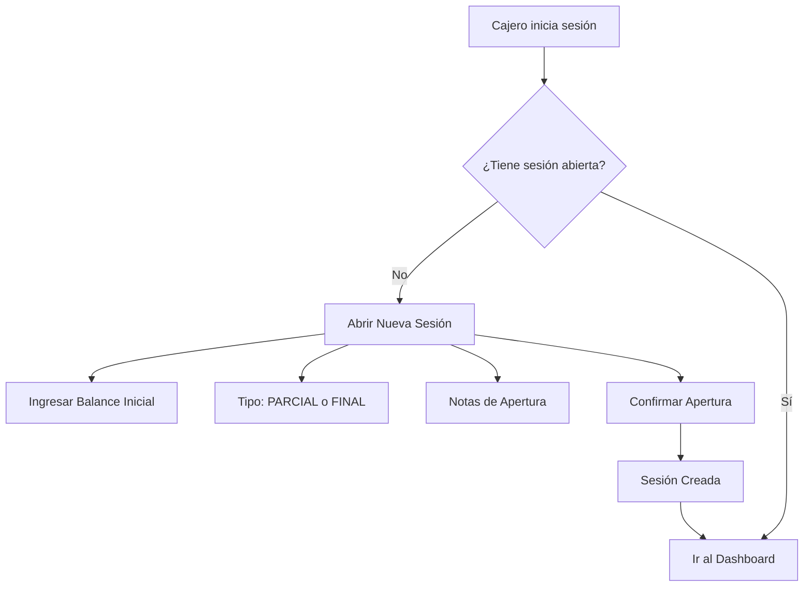
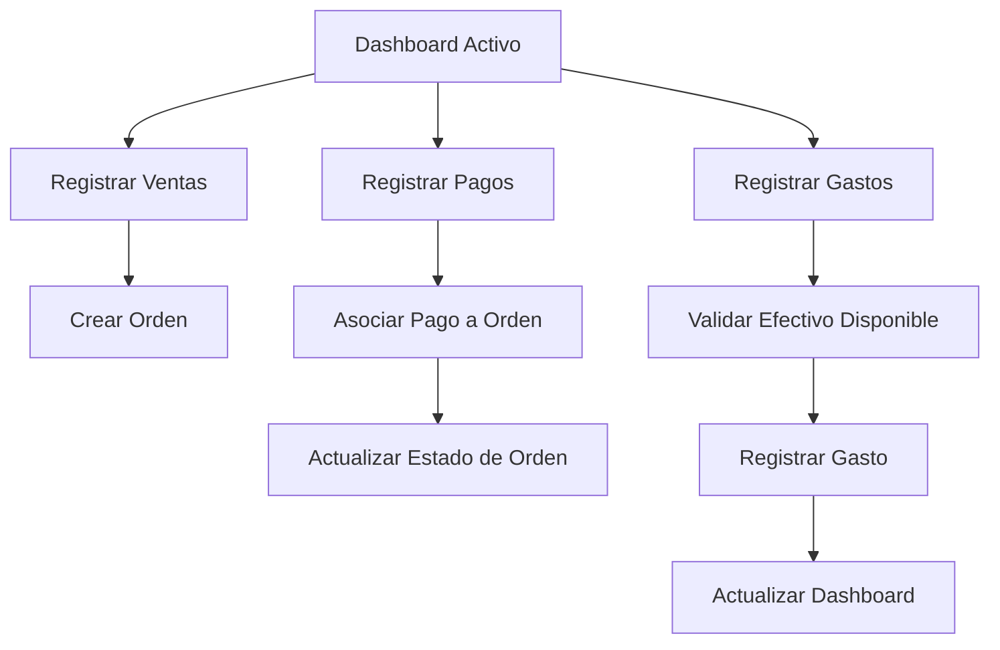
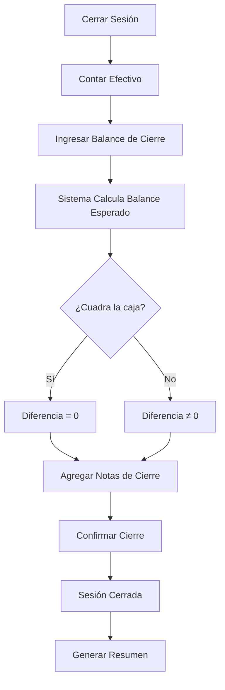

# Sistema de Caja Multi-Tienda - Guía de Operación

## 📋 Índice

1. [Visión General](#visión-general)
2. [Características Principales](#características-principales)
3. [Arquitectura del Sistema](#arquitectura-del-sistema)
4. [Flujo de Operación](#flujo-de-operación)
5. [Guía de Uso](#guía-de-uso)
6. [Migraciones de Base de Datos](#migraciones-de-base-de-datos)
7. [API y Servicios](#api-y-servicios)
8. [Mejores Prácticas](#mejores-prácticas)
9. [Próximos Pasos](#próximos-pasos)

---

## Visión General

Sistema de punto de venta (POS) con soporte multi-tienda que permite la gestión completa de cajas registradoras, incluyendo:

- ✅ Apertura y cierre de sesiones de caja con validación multi-shop
- ✅ Dashboard reactivo con métricas en tiempo real
- ✅ Sumatorias por tipo de pago (Efectivo, Yape, Tarjetas, etc.)
- ✅ Gestión de gastos de caja chica con historial
- ✅ Seguimiento de órdenes con correlativo por sesión
- ✅ Flujo de efectivo con cálculos automáticos
- ✅ Aislamiento completo entre tiendas

---

## Características Principales

### 1. Multi-Tienda (Multi-Shop)

- Cada tienda (`shop`) tiene sus propias sesiones de caja
- Los cajeros pueden tener sesiones activas en diferentes tiendas
- Las órdenes están asociadas a una tienda específica
- No hay confusión entre órdenes de diferentes tiendas

### 2. Dashboard Reactivo

El dashboard muestra en tiempo real:

#### 💵 Flujo de Efectivo

- **Balance Inicial**: Caja chica al abrir
- **Efectivo Ingreso**: Total de pagos en efectivo
- **Gastos**: Total de gastos de caja chica
- **Efectivo Esperado**: Balance inicial + ingresos - gastos
- **Efectivo Actual**: Cálculo en tiempo real

#### 💳 Ingresos por Método de Pago

- Efectivo
- Yape
- Tarjetas (Débito/Crédito)
- Transferencias/Depósitos
- Otros (Plin, Dólares, etc.)

#### 💰 Gastos de Caja Chica

Por categoría:

- Operativo
- Administrativo
- Mantenimiento
- Compras Menores
- Otro

#### 📊 Estado de Órdenes

- Total de órdenes procesadas
- Pendientes de pago
- Pagos parciales
- Completamente pagadas
- Total de ventas vs. total recaudado

### 3. Gestión de Gastos de Caja Chica

- Registro de gastos con validación de efectivo disponible
- Categorización de gastos
- Comprobantes y notas
- Historial completo por sesión
- Autorización por empleado

### 4. Correlativo de Órdenes

- El número de orden (`order_number`) se genera automáticamente
- Es secuencial y único por sesión
- Se resetea con cada nueva sesión (PARCIAL o FINAL)
- **Importante**: Es solo indicativo, no debe usarse como ID único

---

## Arquitectura del Sistema

### Esquema de Base de Datos

#### Tablas Principales

```sql
-- Sesiones de Caja
sales.cash_register_sessions
  - id (UUID, PK)
  - shop_id (UUID, FK → core.shops)
  - cashier_id (UUID, FK → hr.employees)
  - session_number (SERIAL)
  - session_type (PARCIAL, FINAL)
  - status (ABIERTO, CERRADO)
  - opening_balance / closing_balance
  - cash_total, card_total, transfer_total, etc.
  - total_orders, total_payments

-- Gastos de Caja Chica
sales.cash_expenses
  - id (UUID, PK)
  - cash_register_session_id (UUID, FK)
  - shop_id (UUID, FK)
  - amount (NUMERIC)
  - category (OPERATIVO, ADMINISTRATIVO, ...)
  - description, receipt_number, notes
  - authorized_by_id (UUID, FK)

-- Órdenes
sales.orders
  - id (UUID, PK)
  - shop_id (UUID, FK)
  - order_number (SERIAL) ← Correlativo por sesión
  - payment_status (PENDIENTE, PARCIAL, PAGADO)
  - final_amount, advance, remaining_balance

-- Pagos
sales.payments
  - id (UUID, PK)
  - order_id (UUID, FK)
  - cash_register_session_id (UUID, FK)
  - amount (NUMERIC)
  - payment_method (EFECTIVO, YAPE, TARJETA_*, ...)
```

#### Funciones RPC

```sql
-- Gestión de Sesiones
sales.open_cash_register_session(...)
sales.close_cash_register_session(...)
sales.get_session_dashboard(p_session_id UUID) → JSON

-- Gestión de Gastos
sales.register_cash_expense(...) → JSON
sales.get_session_expenses(p_session_id UUID) → TABLE

-- Gestión de Pagos
sales.register_payment(...) → JSON
sales.get_order_payment_history(p_order_id UUID) → TABLE
```

### Arquitectura Frontend (Angular 19+)

#### Estructura de Componentes

```
src/app/features/cashier/
  ├── cash-register-dashboard/     # Dashboard principal
  │   ├── cash-register-dashboard.ts
  │   └── cash-register-dashboard.html
  ├── cash-register-open/          # Abrir sesión
  ├── cash-register-close/         # Cerrar sesión
  ├── daily-sales/                 # Ventas del día
  └── cash-expenses/               # Gastos de caja chica
      ├── cash-expenses.ts
      └── cash-expenses.html
```

#### Servicios

```typescript
CashRegisterService
  - currentSession: Signal<CashRegisterSession | null>
  - openSession(payload): Promise<OpenSessionResponse>
  - closeSession(payload): Promise<CloseSessionResponse>
  - getSessionDashboard(sessionId): Promise<SessionDashboard>
  - registerExpense(payload): Promise<RegisterExpenseResponse>
  - getSessionExpenses(sessionId): Promise<ExpenseView[]>
```

---

## Flujo de Operación

### 1. Inicio de Turno



**Pasos:**

1. El cajero ingresa al módulo de caja
2. Si no tiene sesión abierta, debe abrir una nueva
3. Selecciona el tipo de sesión:
   - **PARCIAL**: Corte intermedio durante el día
   - **FINAL**: Corte al finalizar el día
4. Ingresa el balance inicial (caja chica)
5. Opcionalmente agrega notas
6. El sistema valida que no haya otra sesión abierta en esa tienda
7. Se crea la sesión y se muestra el dashboard

### 2. Operación Durante el Turno



**Actividades:**

#### a) Registrar Ventas

- Crear órdenes con detalles de productos
- Cada orden recibe un `order_number` secuencial
- El estado inicial es `PENDIENTE`

#### b) Registrar Pagos

- Los pagos pueden ser totales o parciales
- Métodos de pago: Efectivo, Yape, Tarjetas, Transferencias, etc.
- El sistema actualiza automáticamente:
  - `advance`: Total pagado
  - `remaining_balance`: Saldo pendiente
  - `payment_status`: PENDIENTE → PARCIAL → PAGADO

#### c) Registrar Gastos

- Gastos de caja chica durante la sesión
- Categorías: Operativo, Administrativo, Mantenimiento, etc.
- **Validación importante**: Solo se puede gastar el efectivo disponible
- Fórmula: `Efectivo Disponible = Balance Inicial + Efectivo Ingresado - Gastos Registrados`

### 3. Cierre de Turno



**Pasos:**

1. El cajero cuenta el efectivo físico
2. Ingresa el balance de cierre
3. El sistema calcula automáticamente:
   - Balance Esperado = Balance Inicial + Efectivo Ingreso - Gastos
   - Diferencia = Balance de Cierre - Balance Esperado
4. Si hay diferencia (faltante o sobrante), se registra
5. Se agregan notas explicativas
6. Se cierra la sesión y se genera el resumen final

---

## Guía de Uso

### Para Cajeros

#### 1. Abrir Sesión de Caja

1. Navega a **Caja** → **Abrir Sesión**
2. Completa el formulario:
   - **Balance Inicial**: Efectivo en caja chica (ej: S/. 100.00)
   - **Tipo de Sesión**: PARCIAL o FINAL
   - **Notas**: Cualquier observación relevante
3. Haz clic en **Abrir Sesión**
4. El sistema redirige al dashboard automáticamente

#### 2. Ver Dashboard

El dashboard muestra en tiempo real:

- Balance inicial y tiempo transcurrido
- Total de órdenes procesadas
- Flujo de efectivo detallado
- Ingresos por método de pago
- Gastos de caja chica
- Estado de órdenes (pendientes, parciales, pagadas)

**Botón de Actualizar**: Haz clic en el ícono de recarga para actualizar las métricas.

#### 3. Registrar Gastos de Caja Chica

1. Desde el dashboard, haz clic en **Gastos**
2. Completa el formulario:
   - **Monto**: Cantidad gastada
   - **Categoría**: Tipo de gasto
   - **Descripción**: Motivo detallado (mínimo 5 caracteres)
   - **Número de Comprobante**: Opcional
   - **Notas**: Información adicional
3. Haz clic en **Registrar Gasto**
4. El sistema valida que haya efectivo disponible
5. Si es exitoso, se actualiza el historial y el efectivo disponible

**Importante**: No puedes gastar más efectivo del disponible.

#### 4. Ver Ventas del Día

1. Haz clic en **Ventas del Día**
2. Verás todas las órdenes desde que se abrió la sesión
3. Filtros disponibles:
   - Todas
   - Pendientes
   - Parciales
   - Pagadas
4. Puedes registrar pagos directamente desde esta vista

#### 5. Cerrar Sesión de Caja

1. Desde el dashboard, haz clic en **Cerrar Caja**
2. Cuenta el efectivo físico en caja
3. Ingresa el **Balance de Cierre**
4. Revisa el resumen:
   - Balance Esperado
   - Diferencia (si la hay)
   - Totales por método de pago
   - Total de gastos
5. Agrega **Notas de Cierre** si es necesario
6. Haz clic en **Cerrar Sesión**
7. El sistema genera el resumen final

### Para Administradores

#### Monitorear Sesiones Activas

```sql
-- Vista de sesiones activas por tienda
SELECT * FROM sales.active_sessions_by_shop;
```

Retorna:

- ID de sesión
- Tienda y cajero
- Tiempo abierto
- Total de órdenes y pagos

#### Consultar Historial de Gastos

```sql
-- Gastos de una sesión específica
SELECT * FROM sales.get_session_expenses('session-uuid');
```

#### Obtener Dashboard Completo

```sql
-- Dashboard de sesión con todas las métricas
SELECT * FROM sales.get_session_dashboard('session-uuid');
```

---

## Migraciones de Base de Datos

### Orden de Ejecución

1. **01_CREATE_SCHEMA_OBJECTS.sql** - Esquemas y funciones base
2. **02_INVENTORY.sql** - Tablas de inventario
3. **03_PERMISOS.sql** - Roles y permisos
4. **04_KARDEX.sql** - Kardex de inventario
5. **05_SALES.sql** - Módulo de ventas y caja
6. **06_MIGRATION_POS_PAYMENTS.sql** - Migración de pagos
7. **07_RLS_SALES.sql** - Row Level Security
8. **08_CASH_EXPENSES_AND_IMPROVEMENTS.sql** ← **NUEVO**

### Aplicar Migración

#### Opción 1: Desde Supabase Dashboard

1. Abre el SQL Editor en Supabase
2. Copia el contenido de `08_CASH_EXPENSES_AND_IMPROVEMENTS.sql`
3. Ejecuta el script
4. Verifica que no haya errores

#### Opción 2: Desde CLI

```bash
psql -h your-project.supabase.co -U postgres -d postgres -f media/db/08_CASH_EXPENSES_AND_IMPROVEMENTS.sql
```

### Qué Incluye la Migración

1. **Tabla `sales.cash_expenses`**
   - Registro de gastos de caja chica
   - Categorización y validación
   - Relación con sesiones y tiendas

2. **Funciones RPC Mejoradas**
   - `open_cash_register_session` con validación multi-shop
   - `close_cash_register_session` con gastos incluidos
   - `register_cash_expense` con validación de efectivo
   - `get_session_expenses` para historial
   - `get_session_dashboard` para métricas completas

3. **Índices de Performance**
   - Índices optimizados para consultas frecuentes
   - Índices compuestos para filtros múltiples

4. **Vista `active_sessions_by_shop`**
   - Monitoreo de sesiones activas
   - Información de tienda y cajero

---

## API y Servicios

### CashRegisterService (Angular)

#### Métodos Principales

```typescript
// Abrir sesión
async openSession(payload: OpenSessionPayload): Promise<OpenSessionResponse>

// Cerrar sesión
async closeSession(payload: CloseSessionPayload): Promise<CloseSessionResponse>

// Obtener dashboard completo
async getSessionDashboard(sessionId: string): Promise<SessionDashboard>

// Registrar gasto
async registerExpense(payload: RegisterExpensePayload): Promise<RegisterExpenseResponse>

// Obtener gastos de sesión
async getSessionExpenses(sessionId: string): Promise<ExpenseView[]>

// Cargar sesión actual
async loadCurrentSession(sessionId?: string): Promise<void>
```

#### Signals Disponibles

```typescript
// Sesión actual (reactivo)
currentSession: Signal<CashRegisterSession | null>;
```

### Interfaces TypeScript

```typescript
interface SessionDashboard {
  session: CashRegisterSession;
  paymentSummary: PaymentSummary;
  expenseSummary: ExpenseSummary;
  orderStats: OrderStats;
  cashFlow: CashFlow;
  sessionDurationMinutes: number;
}

interface PaymentSummary {
  efectivo: number;
  tarjetaDebito: number;
  tarjetaCredito: number;
  transferencia: number;
  deposito: number;
  yape: number;
  plin: number;
  dolares: number;
  otro: number;
  totalPayments: number;
  totalAmount: number;
}

interface CashFlow {
  openingBalance: number;
  cashIn: number;
  cashOut: number;
  expectedBalance: number;
  currentCash: number;
}
```

---

## Mejores Prácticas

### 1. Gestión de Sesiones

✅ **DO:**

- Siempre abre una sesión antes de comenzar operaciones
- Cierra sesiones al final del turno o al hacer cortes
- Usa PARCIAL para cortes intermedios y FINAL para cierre de día
- Agrega notas detalladas en aperturas y cierres

❌ **DON'T:**

- No dejes sesiones abiertas indefinidamente
- No abras múltiples sesiones en la misma tienda
- No modifiques el balance inicial después de abrir

### 2. Registro de Gastos

✅ **DO:**

- Registra gastos inmediatamente después de realizarlos
- Usa la categoría correcta para mejor análisis
- Incluye comprobantes cuando sea posible
- Describe claramente el motivo del gasto

❌ **DON'T:**

- No registres gastos sin validar efectivo disponible
- No uses categoría "OTRO" si existe una específica
- No omitas descripciones detalladas

### 3. Manejo de Pagos

✅ **DO:**

- Asocia siempre los pagos a la sesión de caja correcta
- Verifica el método de pago antes de registrar
- Confirma el monto con el cliente
- Registra pagos parciales para mantener historial

❌ **DON'T:**

- No registres pagos sin orden asociada
- No uses métodos de pago incorrectos
- No modifiques pagos ya registrados

### 4. Multi-Tienda

✅ **DO:**

- Verifica que estés en la tienda correcta antes de abrir sesión
- Filtra reportes por tienda para análisis específicos
- Mantén configuraciones separadas por tienda

❌ **DON'T:**

- No mezcles órdenes de diferentes tiendas
- No compartas sesiones entre tiendas
- No asumas que el `order_number` es único globalmente

---

## Próximos Pasos

### Funcionalidades Pendientes

#### 1. Reportes y Analytics (Alta Prioridad)

- [ ] Reporte de ventas diarias por tienda
- [ ] Análisis de métodos de pago más usados
- [ ] Gráficos de tendencias de ventas
- [ ] Exportación a PDF/Excel
- [ ] Dashboard gerencial multi-tienda

#### 2. Gestión de Devoluciones (Media Prioridad)

- [ ] Registrar devoluciones de productos
- [ ] Afectar el flujo de efectivo correctamente
- [ ] Historial de devoluciones por sesión

#### 3. Conciliación Bancaria (Media Prioridad)

- [ ] Importar movimientos bancarios
- [ ] Reconciliar pagos digitales
- [ ] Alertas de discrepancias

#### 4. Mejoras de UX (Baja Prioridad)

- [ ] Modo oscuro/claro
- [ ] Atajos de teclado
- [ ] Impresión de tickets de cierre
- [ ] Notificaciones push

#### 5. Seguridad y Auditoría (Alta Prioridad)

- [ ] Registro de todas las acciones críticas
- [ ] Auditoría de modificaciones
- [ ] Implementar RLS completo
- [ ] Políticas de acceso por rol

#### 6. Optimizaciones (Media Prioridad)

- [ ] Cache de datos frecuentes con Dexie
- [ ] Lazy loading de componentes pesados
- [ ] Paginación en listas largas
- [ ] Índices adicionales para queries lentas

### Bugs Conocidos

1. **Correlativo de Órdenes**:
   - ⚠️ El `order_number` puede no reiniciarse correctamente si hay múltiples sesiones
   - **Solución**: Implementar un trigger que maneje el reset basado en sesiones

2. **Validación de Efectivo**:
   - ⚠️ La validación es solo en el backend, el frontend podría mostrar mejor feedback
   - **Solución**: Agregar cálculo de efectivo disponible en tiempo real en el frontend

3. **Performance en Dashboards**:
   - ⚠️ Con muchas transacciones, el dashboard puede tardar en cargar
   - **Solución**: Implementar cache en Redis/Dexie

### Mejoras Técnicas

1. **Testing**:
   - Agregar tests unitarios para servicios
   - Tests de integración para flujos completos
   - Tests E2E para operaciones críticas

2. **Documentación**:
   - Documentar APIs con OpenAPI/Swagger
   - Agregar JSDoc a funciones TypeScript
   - Crear guías de troubleshooting

3. **Monitoreo**:
   - Implementar logging estructurado
   - Métricas de performance
   - Alertas automáticas para errores críticos

---

## Estado Actual del Sistema

### ✅ Completado

- [x] Esquema de base de datos multi-tienda
- [x] Tabla de gastos de caja chica
- [x] Funciones RPC mejoradas con validaciones
- [x] Dashboard reactivo con métricas en tiempo real
- [x] Componente de gestión de gastos
- [x] Sumatorias por tipo de pago
- [x] Flujo de efectivo calculado
- [x] Validación de efectivo disponible
- [x] Interfaces TypeScript completas
- [x] Servicios Angular con signals
- [x] Rutas configuradas

### 🚧 En Progreso

- [ ] Aplicar migración en entorno de producción
- [ ] Testing de funcionalidades
- [ ] Ajustes de UX basados en feedback

### 📝 Pendiente

- [ ] Implementar reportes
- [ ] Sistema de devoluciones
- [ ] Conciliación bancaria
- [ ] Auditoría completa
- [ ] Optimizaciones de performance

---

## Contacto y Soporte

Para reportar bugs o solicitar features, por favor contacta al equipo de desarrollo.

---

**Última actualización**: 30 de enero de 2026
**Versión del sistema**: 2.0.0
**Estado**: Listo para pruebas en entorno de staging
